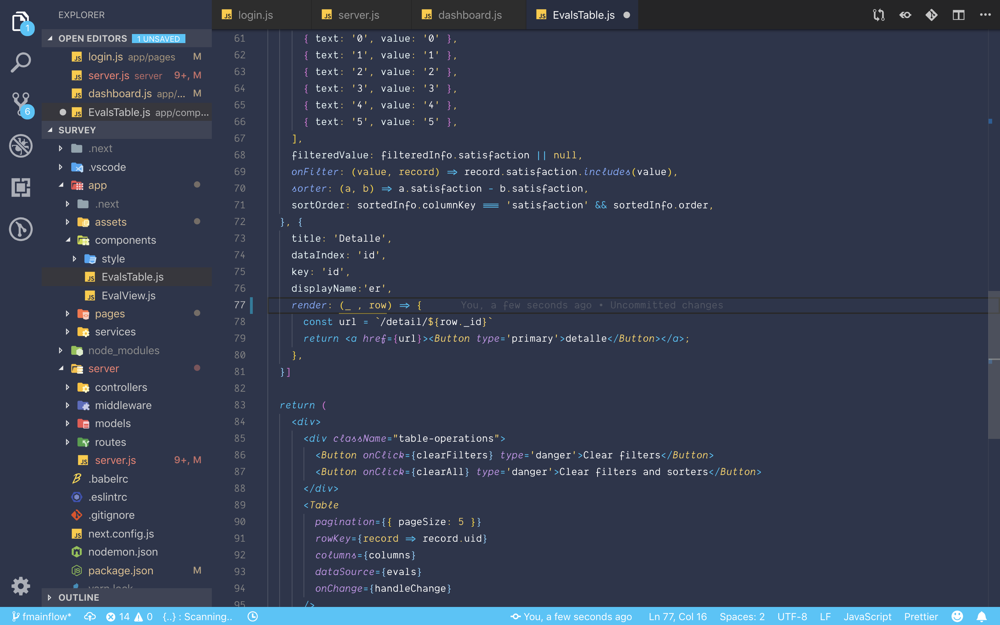

# Ironhack Theme for VS Code

# Installation

1. Open **Extensions** sidebar panel in VS Code. `View → Extensions`
2. Search for `Ironhack theme` 
3. Click **Install** to install it.
4. Click **Reload** to reload the your editor
5. Code > Preferences > Color Theme > **Ironhack theme** | **Ironhack Italic Theme**

## Contributing

1. Open this repo in your terminal and type `npm install`
1. Start to watch for change on the repo with `npm start` - this runs a nodemon task for you and will automatically recompile any changes
1. Open this repo in VS Code
1. Open your command palette and hit type **VSIX**. Select the one that says **Extensions: Install from VSIX...**
1. Load the VSIX file that was created a few steps back
1. Set your editor to use _this_ Ironhack theme - it might help to change the name in package.json to something like "Ironohack Theme Dev" so you can differentiate from the Ironhack theme you've installed from the marketplace. If you get confused, just delete all traces of Ironhack theme and then load the VSIX.
1. Go to the debug sidebar `View → Debug`
1. Press the green arrow beside "Launch Extension"
1. This will then open a second window.
1. Make a change, and then hit the refresh button on your debug toolbar - this is in your first editor - not the one that poped open.
1. Wait a sec, your changes should now be reflected!

Whew. Again, if you have an easier way to style these things, let me know!